# Store Intelligence — Apex Retail

End-to-end CCTV analytics pipeline: raw video → structured events → live store metrics API.

---

## Quick Start (5 commands)

```bash
# 1. Clone and enter
git clone <your-repo-url> store-intelligence && cd store-intelligence

# 2. Place dataset files
# Copy clips/, store_layout.json, pos_transactions.csv into ./data/
# Expected structure:
#   data/clips/STORE_BLR_002/entry.mp4
#   data/clips/STORE_BLR_002/floor.mp4
#   data/clips/STORE_BLR_002/billing.mp4
#   data/store_layout.json
#   data/pos_transactions.csv

# 3. Start the API + Dashboard
docker compose up --build -d

# 4. Run the detection pipeline against all clips
pip install -r requirements.txt   # or use the pipeline container below
cd pipeline && bash run.sh

# 5. Verify
curl http://localhost:8000/stores/STORE_BLR_002/metrics
```

## Data Flow

```
CCTV Video
    │
    ▼
YOLO Detection
    │
    ▼
Tracking
    │
    ▼
Person Re-ID
    │
    ▼
Event Generation
    │
    ▼
Redis Queue
    │
    ▼
FastAPI Ingestion
    │
    ▼
PostgreSQL
    │
    ▼
Analytics Engine
    │
    ▼
Dashboard
```

Dashboard is live at: **http://localhost:8501**
API docs at: **http://localhost:8000/docs**

---

## Project Structure

```
STORE-INTELLIGENCE
│
├── .pytest_cache/
├── .vscode/
│
├── app/
│   ├── __pycache__/
│   ├── db/
│   │   ├── __pycache__/
│   │   ├── __init__.py
│   │   ├── database.py
│   │   └── orm_models.py
│   │
│   ├── __init__.py
│   ├── anomalies.py
│   ├── funnel.py
│   ├── health.py
│   ├── ingestion.py
│   ├── main.py
│   ├── metrics.py
│   └── models.py
│
├── dashboard/
│   ├── __pycache__/
│   ├── __init__.py
│   └── app.py
│
├── data/
│   ├── clip/
│   │   └── STORE_BLR_002/
│   │       ├── CAM 1.mp4
│   │       ├── CAM 2.mp4
│   │       ├── CAM 3.mp4
│   │       ├── CAM 4.mp4
│   │       └── CAM 5.mp4
│   │
│   ├── events/
│   │   ├── cam2.jsonl
│   │   ├── cam3.jsonl
│   │   ├── cam4.jsonl
│   │   ├── cam5.jsonl
│   │   └── STORE_BLR_002_entry.jsonl
│   │
│   ├── store_intelligence.db
│   ├── store_intelligence.db-shm
│   ├── store_intelligence.db-wal
│   └── store_layout.json
│
├── docs/
│   ├── CHOICES.md
│   └── DESIGN.md
│
├── htmlcov/
│
├── pipeline/
│   ├── __pycache__/
│   ├── __init__.py
│   ├── detect.py
│   ├── emit.py
│   ├── event_generator.py
│   ├── ingest_events.py
│   ├── reid.py
│   ├── run.sh
│   ├── tracker.py
│   └── yolov8n.pt
│
├── scripts/
│   ├── __pycache__/
│   ├── __init__.py
│   └── simulate_realtime.py
│
├── tests/
│   ├── __pycache__/
│   ├── __init__.py
│   ├── test_anomalies.py
│   ├── test_ingest.py
│   ├── test_metrics.py
│   └── test_pipeline.py
│
├── venv/
│
├── .env.example
├── .gitignore
├── docker-compose.yml
├── Dockerfile
├── Dockerfile.dashboard
├── pyproject.toml
├── pyrightconfig.json
├── pytest.ini
├── README.md
├── requirements.txt
└── yolov8n.pt
```

---

## System Architecture
```
┌─────────────────────┐
│   CCTV Cameras      │
│ (5 Camera Streams)  │
└──────────┬──────────┘
           │
           ▼
┌─────────────────────┐
│ Computer Vision     │
│ Pipeline            │
│                     │
│ YOLOv8 Detection    │
│ Tracking            │
│ Person Re-ID        │
└──────────┬──────────┘
           │
           ▼
┌─────────────────────┐
│ Event Generator     │
│                     │
│ ENTRY               │
│ ZONE_VISIT          │
│ BILLING_QUEUE       │
│ PURCHASE            │
└──────────┬──────────┘
           │
           ▼
┌─────────────────────┐
│ Redis Queue         │
│ (Event Streaming)   │
└──────────┬──────────┘
           │
           ▼
┌─────────────────────┐
│ FastAPI Backend     │
│                     │
│ Event Ingestion     │
│ Metrics Engine      │
│ Funnel Engine       │
│ Heatmap Engine      │
│ Anomaly Engine      │
└──────────┬──────────┘
           │
           ▼
┌─────────────────────┐
│ PostgreSQL / SQLite │
│ Analytics Database  │
└──────────┬──────────┘
           │
           ▼
┌─────────────────────┐
│ React Dashboard     │
│                     │
│ Real-time Metrics   │
│ Funnel Analytics    │
│ Heatmaps            │
│ Alerts              │
└─────────────────────┘
```
## Dashboard
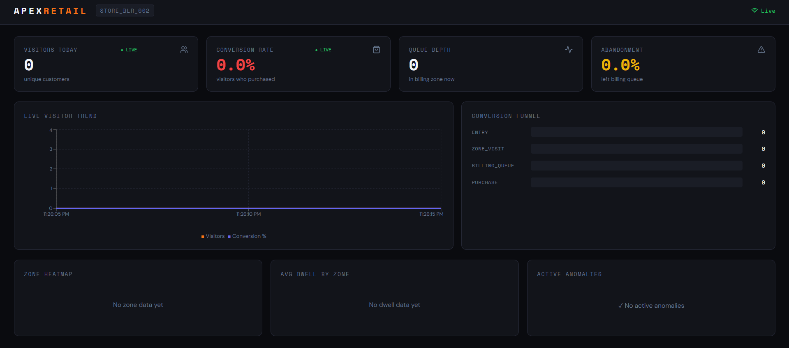

## Running the Detection Pipeline

### Prerequisites
```bash
pip install -r requirements.txt
# YOLOv8 weights are downloaded automatically on first run (~6MB for yolov8n.pt)
# OSNet weights are downloaded automatically by torchreid if available
```

### Single clip
```bash
cd pipeline

python detect.py \
  --video ../data/clips/STORE_BLR_002/entry.mp4 \
  --store-id STORE_BLR_002 \
  --camera-id CAM_ENTRY_01 \
  --layout ../data/store_layout.json \
  --output ../data/events/STORE_BLR_002_entry.jsonl \
  --pos-csv ../data/pos_transactions.csv \
  --device cpu
```

Output: `../data/events/STORE_BLR_002_entry.jsonl` — one event per line.
## Assertion
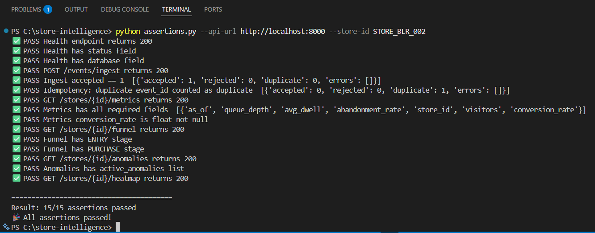


### All clips at once
```bash
cd pipeline
bash run.sh
# Processes all stores in data/clips/ and ingests events into the running API
```

### Ingesting pre-existing event files
```bash
python pipeline/ingest_events.py \
  --events data/events/STORE_BLR_002_entry.jsonl \
  --api-url http://localhost:8000 \
  --batch-size 500
```

---

## API Reference
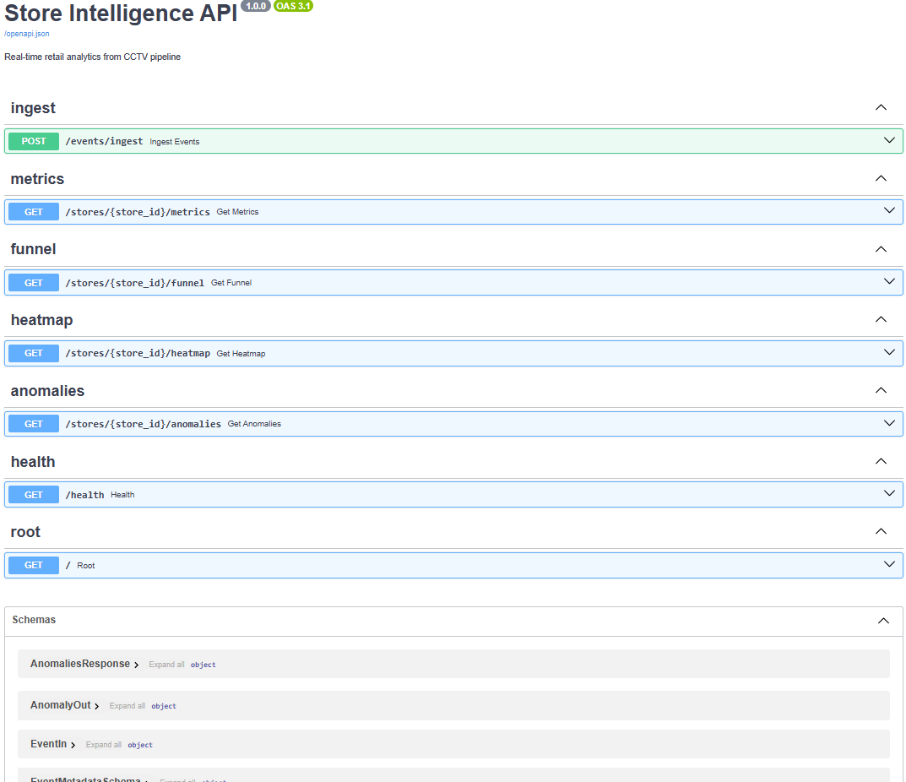


### POST /events/ingest
```bash
curl -X POST http://localhost:8000/events/ingest \
  -H "Content-Type: application/json" \
  -d '{
    "events": [{
      "event_id": "a1b2c3d4-e5f6-7890-abcd-ef1234567890",
      "store_id": "STORE_BLR_002",
      "camera_id": "CAM_ENTRY_01",
      "visitor_id": "VIS_a1b2c3",
      "event_type": "ENTRY",
      "timestamp": "2026-03-03T14:22:10Z",
      "zone_id": null,
      "dwell_ms": 0,
      "is_staff": false,
      "confidence": 0.92,
      "metadata": {"queue_depth": null, "sku_zone": null, "session_seq": 1}
    }]
  }'
```

### GET /stores/{id}/metrics
```bash
curl http://localhost:8000/stores/STORE_BLR_002/metrics | jq
```
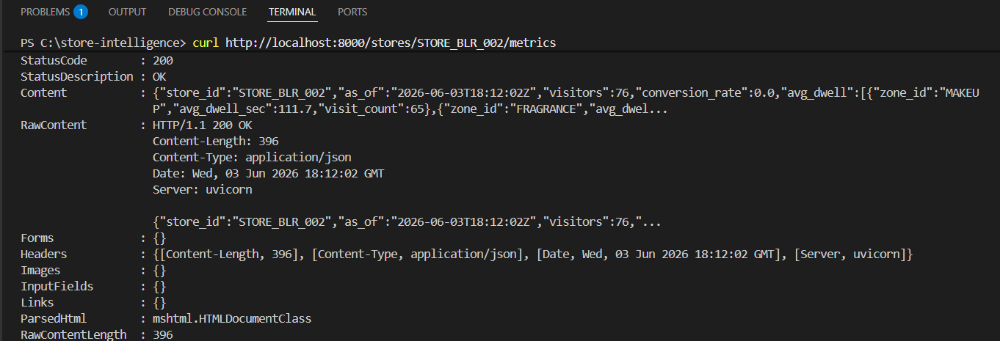
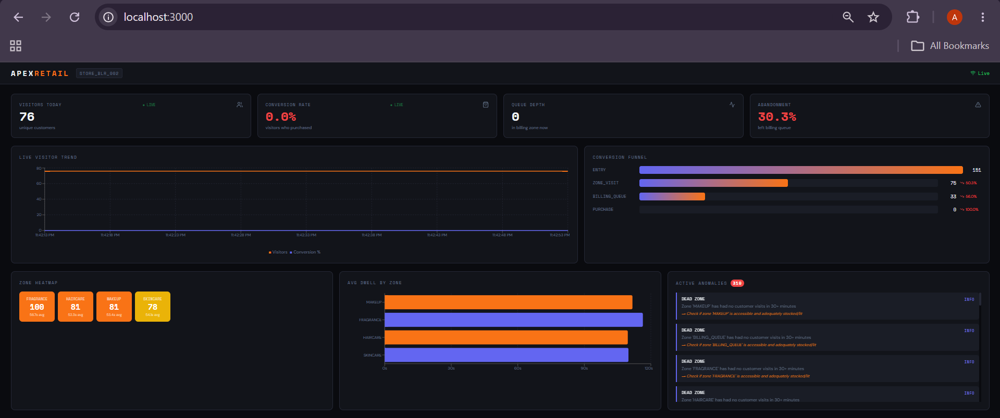


### GET /stores/{id}/funnel
```bash
curl http://localhost:8000/stores/STORE_BLR_002/funnel | jq
```
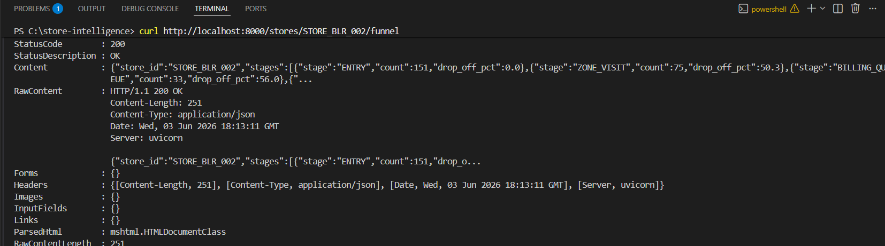
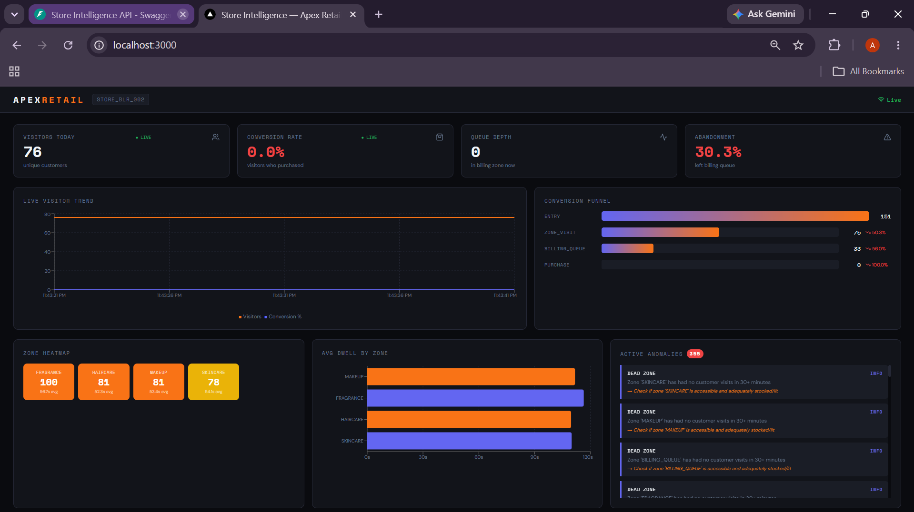


### GET /stores/{id}/heatmap
```bash
curl http://localhost:8000/stores/STORE_BLR_002/heatmap | jq
```
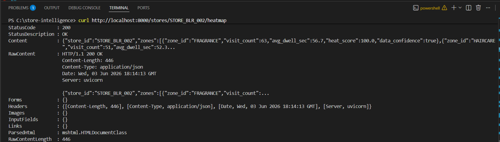
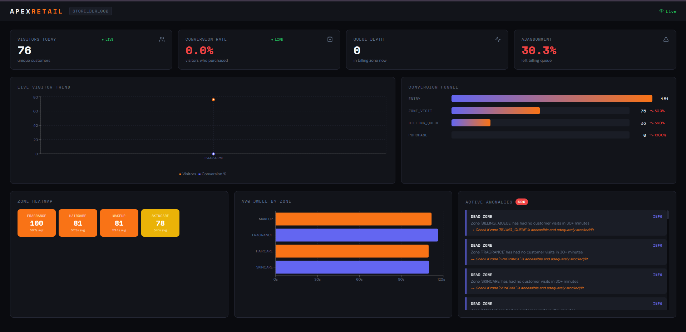


### GET /stores/{id}/anomalies
```bash
curl http://localhost:8000/stores/STORE_BLR_002/anomalies | jq
```
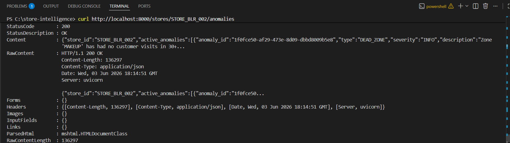
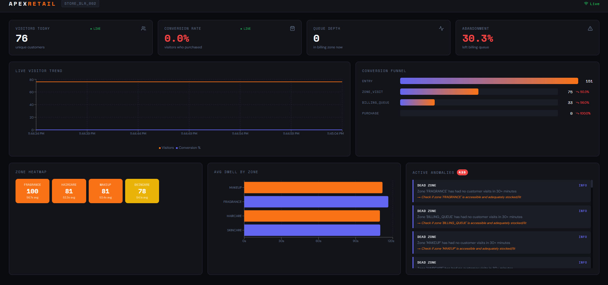

### GET /health
```bash
curl http://localhost:8000/health | jq
```
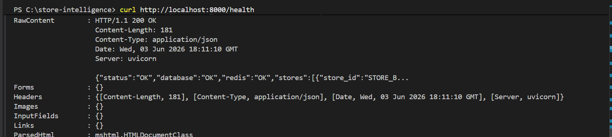
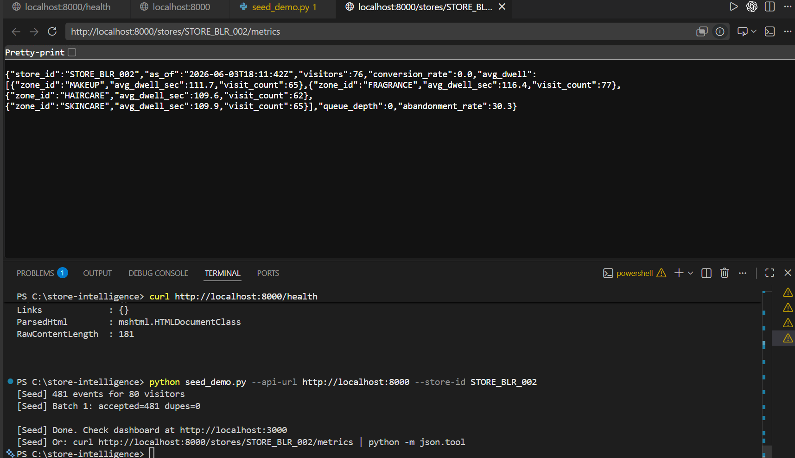

---

## Running Tests

```bash
# Install test dependencies (included in requirements.txt)
pip install pytest pytest-asyncio pytest-cov httpx

# Run all tests with coverage
pytest

# Run specific test file
pytest tests/test_ingest.py -v

# Coverage report
pytest --cov=app --cov-report=html
open htmlcov/index.html
```

Expected coverage: >70% statement coverage across `app/` and `pipeline/`.

---

## Docker

```bash
# Start everything
docker compose up --build -d

# View API logs
docker compose logs -f api

# View dashboard logs
docker compose logs -f dashboard

# Stop everything
docker compose down

# Reset database (warning: deletes all events)
docker compose down -v
rm -f data/store_intelligence.db
docker compose up -d
```
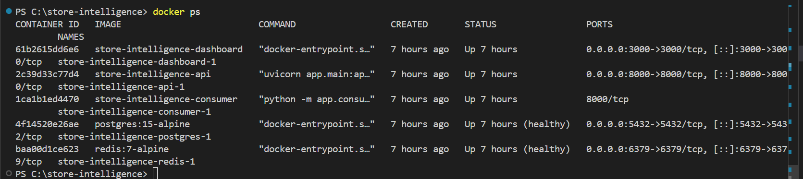


---

## Environment Variables

| Variable | Default | Description |
|----------|---------|-------------|
| `DATABASE_URL` | `sqlite+aiosqlite:///./data/store_intelligence.db` | DB connection string |
| `API_URL` | `http://localhost:8000` | API URL for dashboard |
| `STORE_IDS` | `STORE_BLR_002` | Comma-separated store IDs for dashboard sidebar |
| `LOG_LEVEL` | `INFO` | Logging verbosity |

---

## Architecture Summary

See [`docs/DESIGN.md`](docs/DESIGN.md) for the full architecture.

**Tech stack:**
- Detection: YOLOv8n + ByteTrack + OSNet Re-ID
- API: FastAPI + SQLAlchemy async + SQLite (WAL mode)
- Dashboard: Streamlit + Plotly
- Containerisation: Docker + Docker Compose

---

## Live Dashboard (Part E)

The dashboard at `http://localhost:8501` shows:
- Live visitor count
- Conversion rate gauge
- Queue depth indicator
- Active anomalies with severity colours
- Zone heatmap (normalised 0–100)
- Conversion funnel (waterfall chart)
- Store health status

It auto-refreshes every 10 seconds as events flow in from the pipeline.

---

## Known Limitations

1. **Staff detection accuracy**: HSV hue heuristic works for standard retail uniforms. Unusual uniform colours may misclassify staff. VLM-based labelling is recommended for fine-tuning.

2. **POS correlation**: Conversion rate uses a time-window proxy (billing zone visit within 5 minutes of a transaction). Without a customer_id in POS data, this is the best achievable accuracy.

3. **Cross-camera deduplication**: ReID gallery is per-camera. Two cameras seeing the same person simultaneously may create two events with different visitor_ids. The 5-minute re-entry window mitigates most cases.

4. **SQLite write concurrency**: SQLite WAL mode handles concurrent reads well but limits to one concurrent writer. At >40 stores real-time, PostgreSQL is needed.
